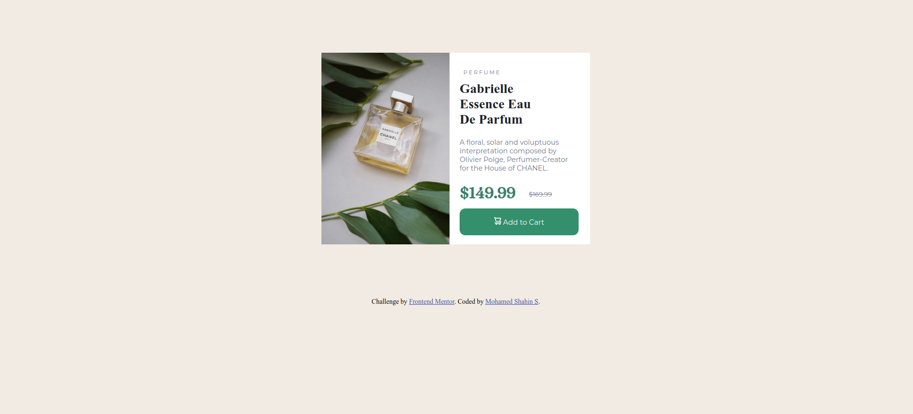

# Frontend Mentor - Product preview card component solution

This is a solution to the [Product preview card component challenge on Frontend Mentor](https://www.frontendmentor.io/challenges/product-preview-card-component-GO7UmttRfa). Frontend Mentor challenges help you improve your coding skills by building realistic projects. 

## Table of contents

- [Overview](#overview)
  - [The challenge](#the-challenge)
  - [Screenshot](#screenshot)
  - [Links](#links)
  - [What I learned](#what-i-learned)
- [Lets Connect](#follow-me)

## Overview
  This challenge is all about the preview of a perfume product. 
  Overall it was a challenging task and is really a good problem to test your skills and coding ability.

### The challenge

Users should be able to:

- View the optimal layout depending on their device's screen size
- See hover and focus states for interactive elements

### Screenshot

### Links

- Solution URL: https://github.com/itsshahinhere/Frontend-mentor-2
- Live Site URL: https://itsshahinhere.github.io/Frontend-mentor-2/

### Built with:

- Semantic HTML5 markup
- CSS custom properties

### What I learned:

I got a very good understanding about inline elements, relative and absolute positioning and also i learnt about the usage of relative units such as rem.

## Follow Me:
- LinkedIn - https://www.linkedin.com/in/itsshahinhere
- Frontend Mentor - https://www.frontendmentor.io/profile/itsshahinhere
- Twitter - https://twitter.com/itsshahinhere
